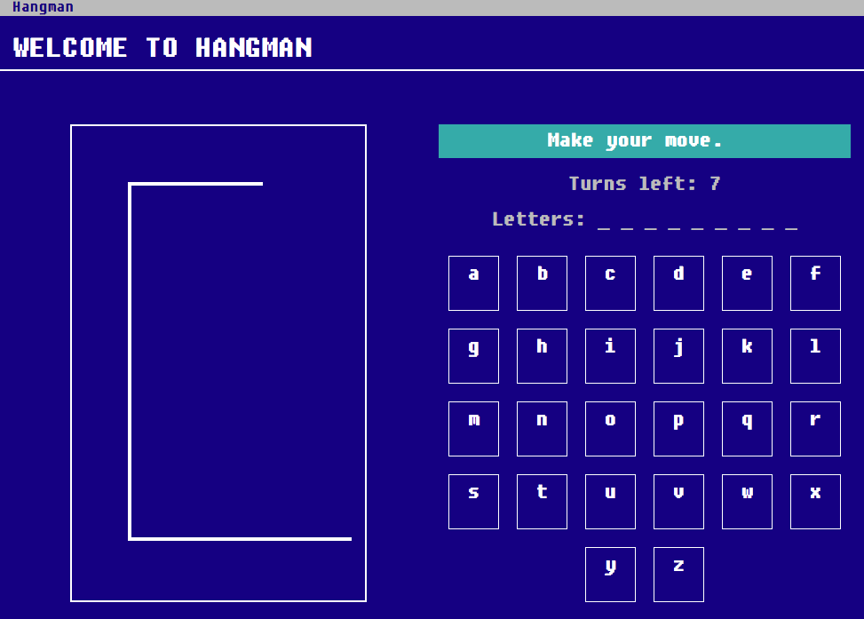

# Hangman game
  
This small, fun pet project has been an excuse to explore:
* Functional programming using Elixir / Phoenix
* Mobx for frontend state management
* New CRA v2 + TypeScript
* [react-testing-library](https://github.com/kentcdodds/react-testing-library) over [enzyme](https://github.com/airbnb/enzyme) for writing tests

The final unremarkable result is running in an [affordable Kubernetes](https://github.com/aldis-ameriks/affordable-kubernetes) cluster in GCP. Link in the description. :)

